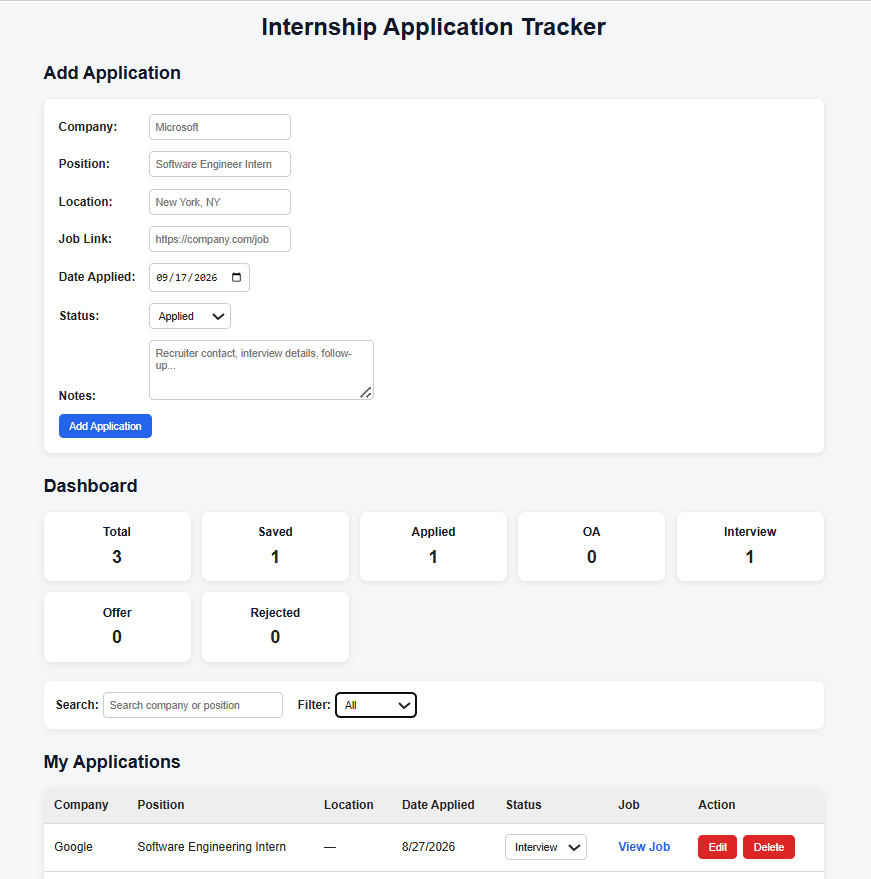

# Internship Application Tracker

A full-stack web application for tracking internship applications throughout the recruiting process.

Users can add, edit, search, filter, and delete applications while tracking application status, location, date applied, job links, and notes.

## Live Demo

[View Live Application](https://internship-application-tracker-production-d580.up.railway.app/)

## Screenshot



## Features

- Add new internship applications
- Edit existing applications
- Delete applications
- Update application status directly from the table
- Search applications by company or position
- Filter applications by status
- Track recruiting stages:
  - Saved
  - Applied
  - OA
  - Interview
  - Offer
  - Rejected
- Track:
  - Company
  - Position
  - Location
  - Date applied
  - Job posting link
  - Notes
- Dashboard showing application statistics
- Persistent data storage using MongoDB Atlas
- Responsive React frontend
- Production deployment on Railway

## Tech Stack

### Frontend
- React
- JavaScript
- HTML
- CSS
- Vite

### Backend
- Node.js
- Express.js
- REST API
- Mongoose

### Database
- MongoDB
- MongoDB Atlas

### Deployment
- Railway

## Architecture

```text
                    Railway
                       |
                       v
               Node.js / Express
                 /           \
                /             \
               v               v
       React Frontend       REST API
       client/dist      /api/applications
                               |
                               v
                            Mongoose
                               |
                               v
                         MongoDB Atlas
```

The React frontend communicates with the Express backend through HTTP requests and JSON. Express uses Mongoose to read and write internship application data in MongoDB Atlas.

In production, Express also serves the compiled React application from `client/dist`.

## REST API

| Method | Endpoint | Description |
|---|---|---|
| GET | `/api/applications` | Get all applications |
| GET | `/api/applications/:id` | Get one application |
| POST | `/api/applications` | Create a new application |
| PUT | `/api/applications/:id` | Update an application |
| DELETE | `/api/applications/:id` | Delete an application |

The GET endpoint also supports filtering using query parameters such as status and company.

Example:

```text
GET /api/applications?status=Interview
```

## Application Model

Each application can contain:

```text
Company
Position
Status
Location
Job Link
Date Applied
Notes
```

Supported statuses:

```text
Saved
Applied
OA
Interview
Offer
Rejected
```

Example application:

```json
{
  "company": "Microsoft",
  "position": "Software Engineer Intern",
  "status": "Applied",
  "location": "Redmond, WA",
  "jobLink": "https://example.com/job",
  "dateApplied": "2026-09-16",
  "notes": "Applied through company careers page"
}
```

## Project Structure

```text
internship-application-tracker/
│
├── client/
│   ├── src/
│   │   ├── App.jsx
│   │   ├── App.css
│   │   ├── index.css
│   │   └── main.jsx
│   │
│   ├── package.json
│   ├── vite.config.js
│   └── index.html
│
├── models/
│   └── Application.js
│
├── app.js
├── server.js
├── package.json
├── .env
└── README.md
```

## Running Locally

### 1. Clone the repository

```bash
git clone https://github.com/ianjwang16/internship-application-tracker
cd internship-application-tracker
```

### 2. Install backend dependencies

```bash
npm install
```

### 3. Install frontend dependencies

```bash
cd client
npm install
cd ..
```

### 4. Configure environment variables

Create a `.env` file in the project root:

```env
MONGODB_URI=mongodb_atlas_connection_string
```

Do not commit `.env` to GitHub.

### 5. Development Mode

Start the Express backend:

```bash
npm start
```

In another terminal:

```bash
cd client
npm run dev
```

React development server:

```text
http://localhost:5173
```

Backend:

```text
http://localhost:3000
```

## Production Build

Build the React frontend:

```bash
npm run build
```

The compiled frontend is generated in:

```text
client/dist
```

Then start the production server:

```bash
npm start
```

Open:

```text
http://localhost:3000
```

Express serves both the React frontend and REST API in production.

## CRUD Operations

The application implements full CRUD functionality:

```text
Create
POST /api/applications

Read
GET /api/applications

Update
PUT /api/applications/:id

Delete
DELETE /api/applications/:id
```

## React Functionality

The React frontend uses state to manage:

- Internship applications
- Form inputs
- Editing state
- Search queries
- Status filters
- Dashboard statistics

When editing an application, the existing application data is loaded into the form and can either be updated or canceled.

## Deployment

The application is deployed on Railway.

Railway:

1. Builds the React frontend using Vite.
2. Starts the Node.js / Express server.
3. Provides the application port through the `PORT` environment variable.
4. Injects the MongoDB Atlas connection string through `MONGODB_URI`.
5. Serves both the React frontend and API from one public domain.

### Railway Build Command

```bash
npm run build
```

### Railway Start Command

```bash
npm start
```

## Future Improvements

- User authentication
- Sort applications by date or company
- Application deadlines
- Interview scheduling
- Follow-up reminders
- Additional recruiting analytics
- Improved mobile layout
- CSV export
- Multiple-user support

## Purpose

This project was built to practice full-stack software development while creating a practical tool for managing internship applications.

It demonstrates experience with:

- React frontend development
- REST API design
- Node.js and Express
- MongoDB and Mongoose
- CRUD operations
- Search and filtering
- State management
- Frontend/backend integration
- Production deployment with Railway